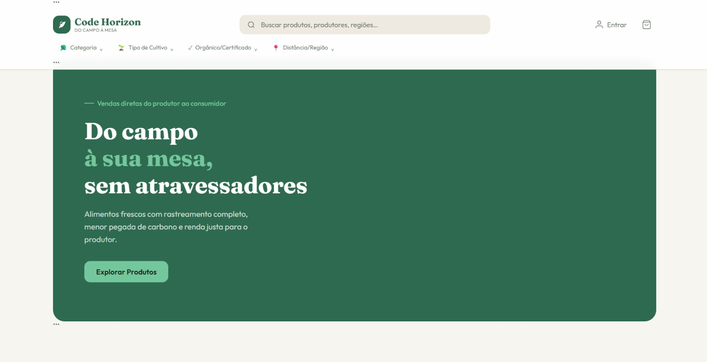
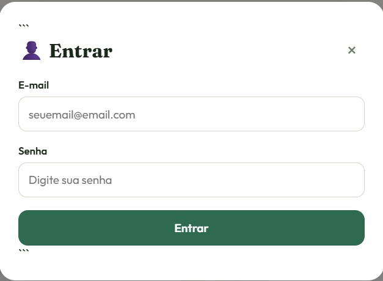
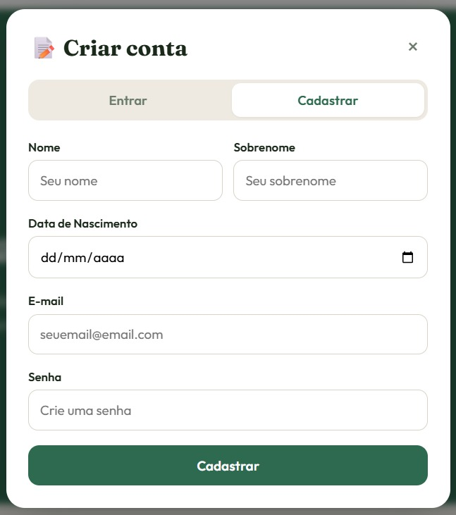

# Code Horizon

Plataforma web para conectar pequenos produtores rurais e agricultores familiares diretamente aos consumidores finais.

---

## Identificação Acadêmica

| Item | Descrição |
|---|---|
| **Instituição de Ensino** | Uniceplac |
| **Curso** | Engenharia de Software |
| **Disciplina** | Projeto Integrado de Certificação em Governança e Gestão de TI |
| **Orientador** | Profº Hudson Neves |

---

## Descrição

O **Code Horizon** é uma plataforma web desenvolvida para aproximar pequenos produtores rurais e agricultores familiares dos consumidores finais. O sistema promove transparência, comércio justo, consumo consciente e acesso prático a alimentos frescos e orgânicos, permitindo o acompanhamento do impacto ambiental e da origem dos produtos.

### Problema que o sistema resolve

- Falta de transparência sobre a procedência e os métodos de cultivo dos alimentos consumidos.
- Dificuldade de inserção e visibilidade de pequenos produtores no mercado digital.

### Público-alvo

| Público | Descrição |
|---|---|
| **Produtores** | Pequenos agricultores rurais e famílias produtoras buscando um canal direto de vendas. |
| **Consumidores** | Pessoas em busca de alimentos frescos, orgânicos e regionais que priorizam o consumo sustentável. |

---

## Objetivos

### Objetivo Geral

Conectar diretamente a produção agrícola familiar ao consumidor final, fortalecendo a economia local, valorizando a agricultura regional e simplificando a compra de alimentos de qualidade.

---

## Funcionalidades

- **Catálogo de Produtos:** Listagem e busca de itens agrícolas frescos.
- **Perfil do Produtor:** Espaço para contar a história da propriedade, localização e métodos de cultivo.
- **Rastreabilidade e Origem:** Exibição detalhada de onde e como o alimento foi produzido.
- **Gestão de Compras:** Carrinho, checkout simplificado e acompanhamento de pedidos.

---

| **Página Home**

---

| **Página de Login**

---

|**Página de Cadastro**

---

## Tecnologias Utilizadas

| Categoria | Tecnologias |
|---|---|
| **Frontend** | HTML5, CSS3, JavaScript |
| **Backend** | A ser definido pela equipe |
| **Banco de Dados** | A ser definido pela equipe |
| **Frameworks e Bibliotecas** | A ser definido pela equipe |

---

## Arquitetura da Solução

A ser definido pela equipe.

---

## Modelagem do Banco de Dados

A ser definido pela equipe.

---

## Pré-requisitos

A ser definido pela equipe.

---

## Instalação

A ser definido pela equipe.

---

## Como Executar

A ser definido pela equipe.

---

## Estrutura do Projeto

A ser definido pela equipe.

---

## Exemplos de Uso

A ser definido pela equipe.

---

## API

A ser definido pela equipe.

---

A ser definido pela equipe.

---

## Equipe do Projeto

| Integrante |
|---|
| Evellyn Marinho |
| Ana Luysa Paiva |
| João Gabriel Monteiro |
| Kaio Lucas de Lima |
| Lucas Barreira |
| Luigi Gomes |
| Luis Gustavo Cardoso |
| Samuel Cardoso |
| João Henrique Gomes |

---

## Status do Projeto

🚧 **Em desenvolvimento.**

---

## Melhorias Futuras

A ser definido pela equipe.

---

## Licença

A ser definido pela equipe.
